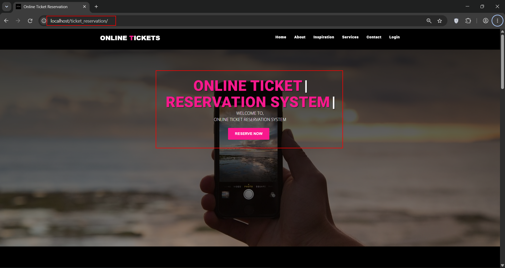
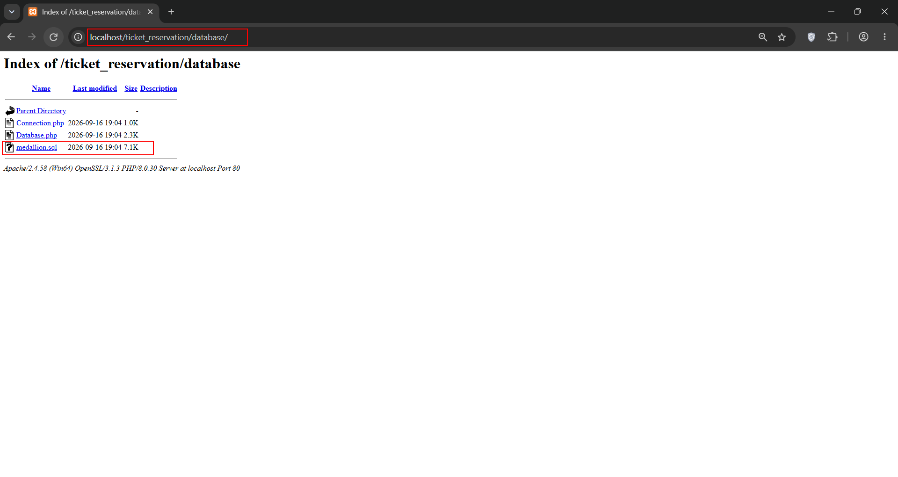
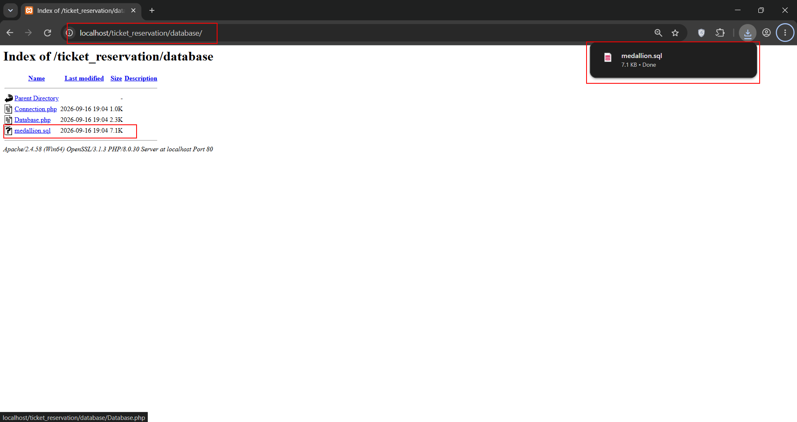
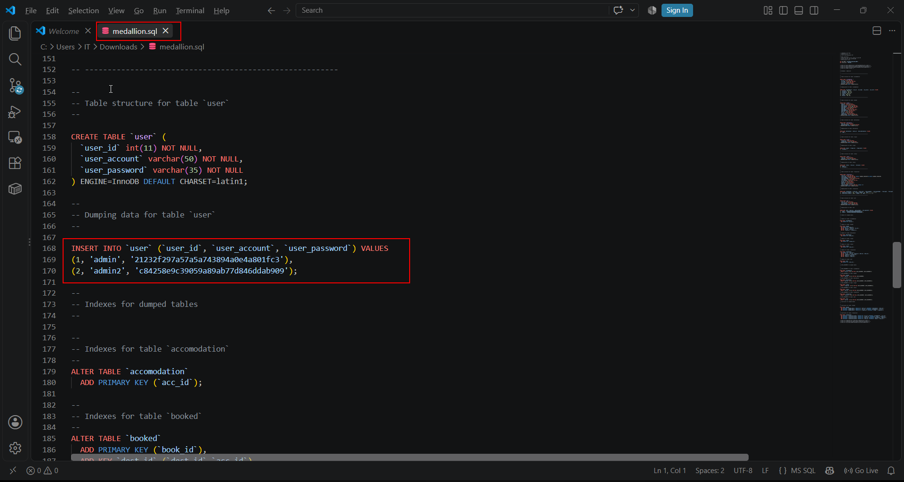
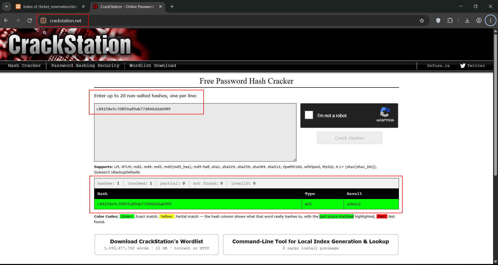

**Title:** Sensitive Information Disclosure - Credentials Exposed via publically accessible sql file

**Severity:** High

**CWE:** CWE-200 – Exposure of Sensitive Information to an Unauthorized Actor

**Researchers:** Karan Parelkar, Abhishek Pisal

**Source / Vendor:** (code-projects Online Ticket Reservation System) https://code-projects.org/online-ticket-reservation-system-in-php-with-source-code/

**Summary**

During security testing of the open-source Online Ticket Reservation System project from code-projects.org , credentials were found in the publicly distributed database file:

**ticket_reservation/database/medallion.sql**

The credentials are accessible by simply downloading and opening the SQL file, without authentication or exploitation.

**Steps to Reproduce**

Set up the project and go to http://localhost/ticket_reservation/ we can see the project is locally deployed 

 
**1. Navigate to /database/**

 
 
**2. Click on medallion.sql**

   

**3. Open medallion.sql in VS Code or any text editor.**

   
    
**4. Credential information can be observed directly in the SQL dump with password hash which can be easily cracked as shown below.**
 
 
 
 

**Impact:**

An attacker who obtains valid credentials may potentially gain unauthorized access to the associated application/account and sensitive information.

**Remediation:**

1. Remove credentials from publicly distributed SQL dumps.
   
2. Replace them with dummy/test credentials.
 
3. Never store passwords in weak hashes; use bcrypt/Argon2id.
 
4. Rotate any credentials that have already been exposed.

**Researchers Information**

**Researcher - 1**

Name: Karan Parelkar 

Independent Security Researcher 

Email: karan.parelkar2005@gmail.com 

GitHub: https://github.com/KaranParelkar 

LinkedIn: https://www.linkedin.com/in/karan-parelkar-6a370125b/

**Researcher – 2**

Name: Abhishek Pisal

Independent Security Researcher 

Email: abhishekpisal09@gmail.com

GitHub: https://github.com/EvilGod108

LinkedIn: https://www.linkedin.com/in/abhishek-pisal-a358bb255/
